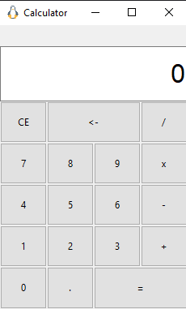

# Calculator

In this project we sought to make a calculator with a graphical interface using tkinter, in addition to the normal functionality of a calculator, it sends the result in binary format of the operations to an arduino, to which it will be connected given its serial port and the speed of transmission of the information , for this we use pyserial.


## Prerequisites

To run this program it is necessary to have **python3**, to check the version with the following command:
```bash
python --version
```
It will also be necessary to have the python package manager system better known as **pip**, check that you have it installed with the following command that gives us the version of pip in the case of having it installed:
```bash
pip -V
```
With pip you will need to install **pyserial**:
```bash
pip install pyserial
```
As well as **tkinter**:
```bash
pip install tk
```
Finally, an Arduino UNO will be needed, with the following circuit:

and the following program loaded:
[link text](src/leds_serial.ino)

## Program execution

To execute the program we need to open the terminal and locate ourselves in the folder where the main program **main.py** is located, in this case said folder is src, once inside said directory, we will execute the following command:

python main.py

another alternative could be:

python3 main.py

## Result of program execution

